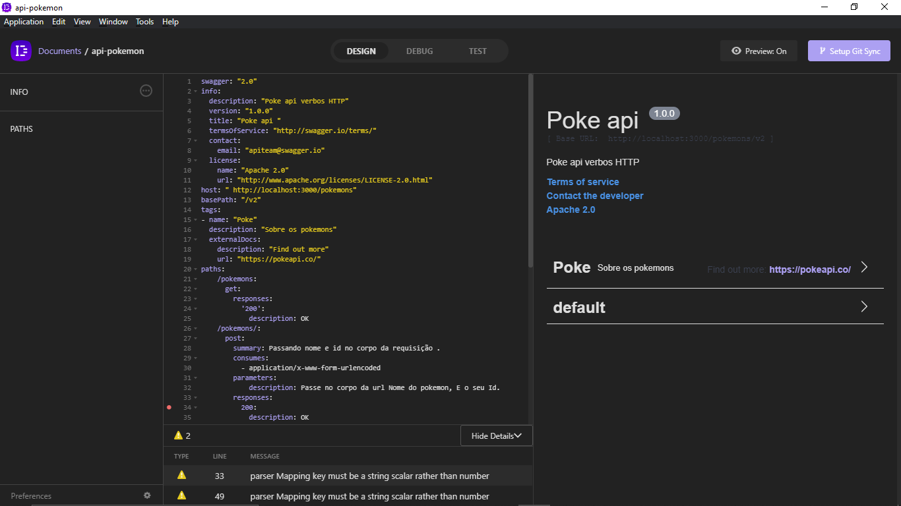
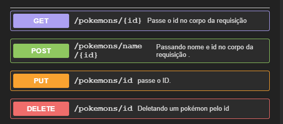

# API Pokédex


The propose here is starting a new API and to do the API documentation for mockup our data at the application. Let's get started!

First of all, we made use of an API with HTTP methods, and to document this we used tools to facilitate the understanding of how to use the methods in the API, such a tool used in the previous example, the INSOMNIA DESIGNER, which has the purpose of making the interface designer API documentation using a [Swagger](https://github.com/swagger-api/swagger-ui) or [OpenAPI](https://github.com/OAI/OpenAPI-Specification) standard. Using a text language called [YAML](https://blog.stackpath.com/yaml/). The links for some that references are bellow:





For now, we gonna look the website finished at this link: [https://pokedex-github-io.vercel.app/](https://pokedex-github-io.vercel.app/) that consuming API data of the mocking in an file in JSON format. 

But before we going to start downloading the application for understand better the code. Type this command on your prompt:

```text
git clone https://github.com/vidal987/Pokedex.vidal.git
cd Pokedex.vidal
```

Open up the code on your favorite IDE, in my case I use VSCode, and in your terminal type npm install for update dependencies for this project. Run `npm start` to see application in your browser. Or then you can open with Live Server extension for VSCode.


After that we going to start with creating the new file and let's renaming like db.json and then copy and paste de code that is here [https://codeshare.io/5glXrw](https://codeshare.io/5glXrw)

We have two types of insomnia, the designer and the core. Basically the core is where you can work by examining the responses that the API will give, such as REST and [GraphQL](https://graphql.org/), whereas the designer is where you can debug your API, testing, managing specifications or editing documents as an OpenApi.

Now search for [https://insomnia.rest/](https://insomnia.rest/) and click em download button for install in your PC. This video shows the page for download insomnia app.



Open up the Insomnia Designer.



You can find the code in YAML format on codeshare.io [https://codeshare.io/senai115](https://codeshare.io/senai115), copy and paste this content in an new document.



How can you see the methods GET, POST, PUT and DELETE are present. Go to GET method clicking in this button, and it's show us more informations like: parameters, and option responses formats. Also, it's possible to copy the [Curl](https://curl.haxx.se/) commands and URL links.


Important: YAML syntax must be well-respected the indentation, because is sensitive case, mainly for spacings. See the example bellow:

```yaml
Syntax

The YAML syntax is extremely simple and readable, as we can see below:

employee:
 name: João
 age: 30
 male
 profession: Programmer
  depend:
   name: Maria
   women

As seen above, YAML allows data structures in a very simple way. In the previous example, we determined the attributes of an employee (name, age, sex and profession), in addition to a relationship with a dependent, who also has his attributes (name and sex).

In JSON, a structure above can be seen as follows:

{
"employee": {
    "name": "João",
    "age": 30,
    "male",
    "profession": "Programmer",
        "dependent": {
            "name": "Maria",
            "women"
        }
    }
}

Symfony - Fundamentals
Symfony Course - Fundamentals
KNOW THE COURSE
We can conclude that…

YAML is also a great alternative to store and structure data to be transferred between different systems. It has a cleaner and more readable syntax than its main “competitors”, XML and JSON and can be used in different programming languages.
Python Developer
Training: Full Python Developer
Learn how to work with relational databases in Python applications using a DB API and MySQL.
KNOW THE TRAINING
Leave your comment
```

Let's go back to the YAML file. This part of code is responsable for generate the GET method. Where we can declare the paths or endpoints that we want to include, and the waited responses in case of achieving the data in JSON format. It's return the status 200 OK when the answer is positive. Also, we can add a brief comments about this, like a instructions for the users on our summary.

```text
paths:
    /pokemons/{id}: 
      get:
        summary: Passe o id no corpo da requisição
        responses:
          '200':
            description: OK
```

The same it's apply to the other methods.


The diferences are that we can see that the template basically is online. While the insomnia Designer application it's installed your own machine. **Swagger**™ is a project used to describe and document RESTful **APIs**. The **Swagger** specification defines a set of files required to describe such an **API**. These files can then be used by the **Swagger**-UI project to display the **API** and **Swagger**-Codegen to generate clients in various languages. It's very easy to document your API in both applications. 

Otherwise, OpenAPI Document it's a document \(or set of documents\) that defines or describes an API. An OpenAPI definition uses and conforms to the OpenAPI Specification.

